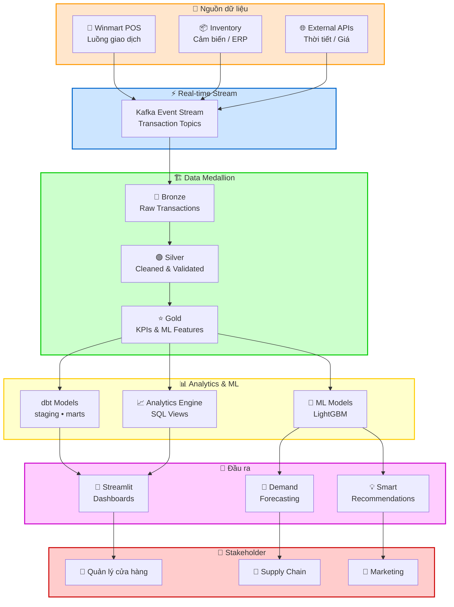
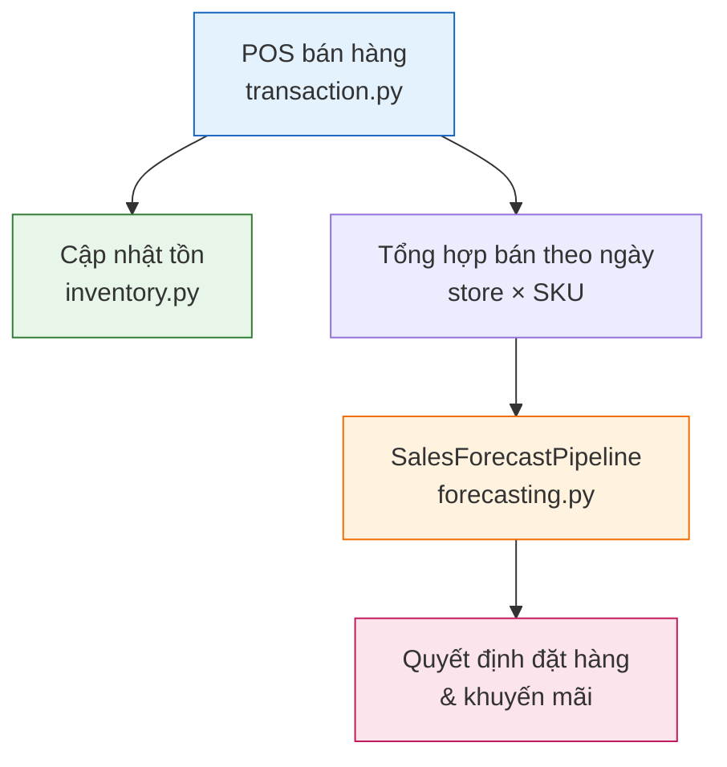

# 🏪 Winmart Retail Analytics Platform

> Nền tảng phân tích bán lẻ đa kênh cho **Winmart**: **POS**, tồn kho, **demand forecasting** (`LightGBM`), chuỗi cung ứng.

**Repo demo:** `transaction.py` · `inventory.py` · `forecasting.py` · `scripts/demo_forecast.py`

## Bài toán

OOS, tồn cao (đặc biệt perishables), forecast Excel khó scale, lệch **POS**–tồn, khuyến mãi/giá đối thủ khó đo. Hệ thống chuẩn hóa dữ liệu và dự báo theo `store_id` × `SKU` có khoảng tin cậy.

## KPI chính

| KPI | Định nghĩa |
|-----|------------|
| **revenue** | Doanh thu từ `POS` |
| **units sold** | Bán theo ngày × cửa hàng × `SKU` |
| **OOS rate** | % `SKU` tồn = 0 |
| **MAPE** | Sai số forecast vs thực tế |
| **days of supply** | Tồn ÷ bán TB ngày |

## Tech Stack

`Python 3.10+` · `FastAPI` · `PostgreSQL` / `TimescaleDB` · `Redis` · `Kafka` · `dbt` · `LightGBM` · `Streamlit` · `Airflow` · `Docker` · `GitHub Actions`

## Kiến trúc





## Module

| Module | File |
|--------|------|
| POS | `transaction.py` |
| Inventory | `inventory.py` |
| Forecasting | `forecasting.py` |

## Cấu trúc repo

```
├── data/samples/daily_sales_sample.csv
├── scripts/demo_forecast.py
├── tests/
├── forecasting.py · inventory.py · transaction.py
└── requirements.txt
```

## Quick Start

```bash
git clone https://github.com/willtran112358/ecommerce-analytics-data-platform.git
cd ecommerce-analytics-data-platform
python -m venv venv && venv\Scripts\activate   # Windows
pip install -r requirements.txt
python scripts/demo_forecast.py
pytest tests/ -v
```

## API (production target)

`GET /stores` · `GET /stores/{store_id}/inventory` · `GET /stores/{store_id}/performance` · `POST /transactions` · `GET /analytics/forecast` · `GET /supply-chain/replenishment`

---

**Will Tran** — [@willtran112358](https://github.com/willtran112358)
