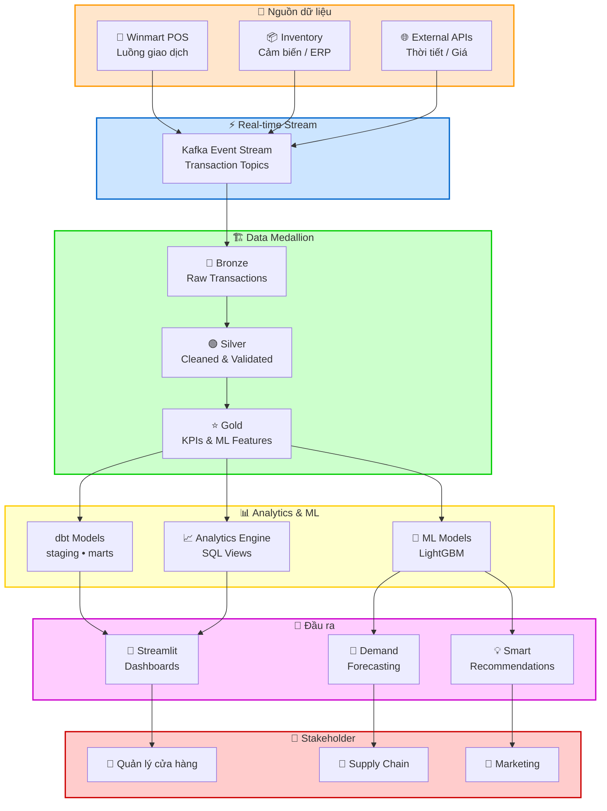
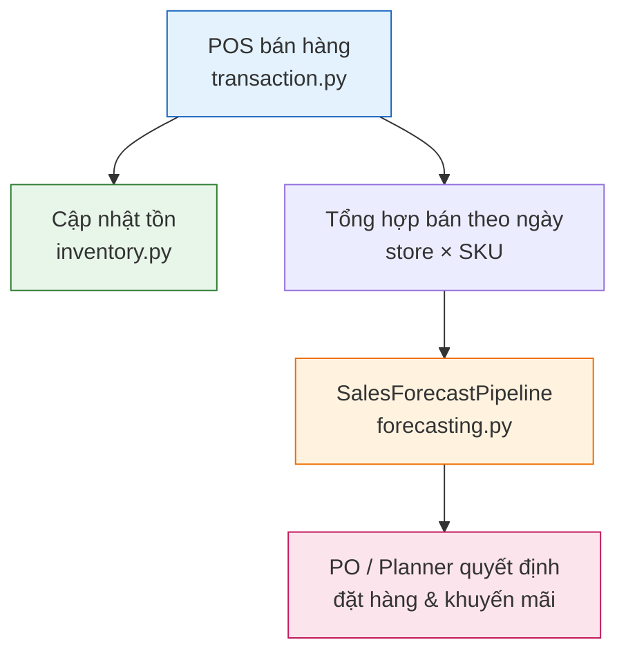

# 🏪 Winmart Retail Analytics Platform

> Nền tảng phân tích bán lẻ đa kênh cho chuỗi siêu thị **Winmart**: xử lý **POS** thời gian thực, tối ưu tồn kho, **demand forecasting**, và hỗ trợ quyết định chuỗi cung ứng.

## 🎯 Bài toán nghiệp vụ Winmart

Chuỗi siêu thị Winmart vận hành nhiều cửa hàng, hàng nghìn `SKU` (thực phẩm tươi, khô, FMCG). Các pain point thường gặp:

1. **Thiếu hàng (OOS)** — mất doanh thu, trải nghiệm khách kém.
2. **Tồn kho cao** — đặc biệt hàng có hạn sử dụng (perishables).
3. **Dự báo thủ công** — Excel theo cửa hàng, khó scale toàn mạng.
4. **POS và tồn kho lệch số** — cần đối soát (reconciliation) hằng ngày.
5. **Khuyến mãi / giá đối thủ** — ảnh hưởng nhu cầu nhưng khó đo lường nhanh.

Nền tảng này thiết kế để **chuẩn hóa dữ liệu** và đưa ra **dự báo có khoảng tin cậy**, hỗ trợ Supply Chain ra quyết định đặt hàng dựa trên số liệu thay vì cảm tính.

---

## 📊 KPI & định nghĩa

| KPI / Metric | Định nghĩa nghiệp vụ | Nguồn dữ liệu gợi ý |
|--------------|----------------------|---------------------|
| **Doanh thu (revenue)** | Tổng tiền sau chiết khấu, trước/thuế tùy policy | `POS` / `transaction` |
| **Units sold** | Số lượng bán theo ngày × cửa hàng × `SKU` | Aggregate từ `POS` |
| **OOS rate** | % `SKU` có tồn = 0 trong khung giờ mở cửa | Inventory snapshot |
| **Forecast accuracy (MAPE)** | Sai số dự báo so với thực tế | `forecasting.py` vs actuals |
| **Days of supply** | Tồn hiện tại ÷ bán trung bình ngày | Inventory + forecast |
| **Fill rate** | % đơn đặt hàng được giao đủ | Supply chain (lộ trình) |

---

## Tổng quan kỹ thuật (Overview)

Hệ thống phân tích bán lẻ xây cho vận hành chuỗi siêu thị Winmart:

- Xử lý và đối soát giao dịch **POS** theo thời gian thực trên toàn mạng cửa hàng
- Quản lý tồn kho đa điểm kèm **demand forecasting** cho `SKU` FMCG
- Phân khúc khách hàng & ưu đãi cá nhân hóa (loyalty) — *lộ trình*
- Analytics hiệu suất cửa hàng & benchmark mạng Winmart
- Tối ưu chuỗi cung ứng, dự báo tồn cho hàng tươi và khô
- Cảnh báo **out-of-stock** / sắp chạm `reorder_point`

---

## Tech Stack

| Lớp | Công nghệ |
|-----|-----------|
| **Backend** | Python 3.10+ (`FastAPI`, `SQLAlchemy`) |
| **Database** | `PostgreSQL` + `TimescaleDB` |
| **Real-time** | `Redis` (cache), `Kafka` (event streaming) |
| **Analytics** | `dbt`, `Pandas`, `NumPy` |
| **ML** | `Scikit-learn`, `LightGBM` (forecasting) |
| **Dashboard** | `Streamlit` + `Plotly` |
| **Orchestration** | `Airflow` |
| **Infrastructure** | `Docker`, `Kubernetes`, `AWS S3` |
| **CI/CD** | `GitHub Actions` |

---

## Kiến trúc mục tiêu (Target Architecture)

Sơ đồ dưới mô tả **trạng thái đầy đủ** khi triển khai production. Repo hiện tại là **POC/demo** tập trung vào lõi Python (`transaction.py`, `inventory.py`, `forecasting.py`).



### Luồng nghiệp vụ: từ bán hàng → dự báo → đặt hàng



---

## Các module chính (Key Modules)

| Module | Mô tả (nghiệp vụ) | File / trạng thái repo |
|--------|-------------------|-------------------------|
| **POS Processing** | Kiểm tra hợp lệ giao dịch, tính tổng tiền, đối soát | ✅ `transaction.py` |
| **Inventory Management** | Theo dõi tồn, `reorder_point`, cảnh báo đặt hàng | ✅ `inventory.py` |
| **Demand Forecasting** | Dự báo bán theo cửa hàng × `SKU`, khoảng tin cậy 90% | ✅ `forecasting.py` |
| **Customer Analytics** | RFM, phân khúc loyalty | 🔜 Lộ trình |
| **Supply Chain** | Gợi ý replenishment, phân bổ kho | 🔜 Lộ trình |
| **Store Performance** | KPI cửa hàng, benchmark mạng | 🔜 Lộ trình |

---

## Cấu trúc repo hiện tại (Actual Project Structure)

```
ecommerce-analytics-data-platform/
├── data/
│   └── samples/
│       └── daily_sales_sample.csv    # Mẫu bán theo ngày (demo)
├── scripts/
│   └── demo_forecast.py              # Chạy thử forecasting
├── tests/
│   ├── test_forecasting.py
│   └── test_transaction.py
├── .github/workflows/ci.yml
├── forecasting.py                    # SalesForecastPipeline, DemandForecaster
├── inventory.py                      # InventoryManager, SKUInventory
├── transaction.py                    # TransactionProcessor, Transaction
├── requirements.txt
├── pyproject.toml
└── README.md
```

### Cấu trúc mục tiêu (khi mở rộng full platform)

```
src/
├── pos/          # transaction, reconciler, validator
├── inventory/    # manager, reorder, sku
├── forecasting/  # demand, models, evaluator
├── analytics/    # customer, store, metrics
├── api/          # FastAPI app
├── stream/       # Kafka consumer
└── dashboards/   # Streamlit
dbt/ · airflow/ · docker-compose.yml
```

---

## Sales Forecasting (Dự báo bán — VinMart / Winmart)

### PO cần biết gì?

- **Đơn vị dự báo:** số lượng bán (`units`) / ngày / `store_id` / `SKU`
- **Horizon mặc định:** 7 ngày (`horizon_days=7`)
- **Khoảng tin cậy:** 90% → `lower_bound`, `upper_bound` (lập kế hoạch an toàn: dùng `upper_bound` cho hàng hot, `lower_bound` cho hàng ít biến động)
- **Model:** `LightGBM` (mặc định), fallback `RandomForest` nếu môi trường thiếu `lightgbm`

### Feature đầu vào (giải thích cho PO)

| Feature | Ý nghĩa nghiệp vụ |
|---------|-------------------|
| `day_of_week` | Thứ trong tuần (cuối tuần thường cao điểm) |
| `seasonality` | Mùa vụ / chu kỳ (sin theo ngày trong năm) |
| `promotion` | Có khuyến mãi hay không (0/1) |
| `competitor_price` | Chỉ số giá đối thủ (chuẩn hóa) |

### Chạy demo

```bash
python scripts/demo_forecast.py
```

```python
from forecasting import SalesForecastPipeline
import pandas as pd

daily = pd.read_csv("data/samples/daily_sales_sample.csv", parse_dates=["date"])
pipe = SalesForecastPipeline(backend="lightgbm")
pipe.fit(daily)
forecast_df = pipe.to_dataframe(pipe.predict_horizon(daily, horizon_days=7))
```

**Cột đầu ra `forecast_df`:**

| Cột | Ý nghĩa |
|-----|---------|
| `store_id` | Mã cửa hàng (vd. `WINMART_HCM_001`) |
| `sku` | Mã sản phẩm |
| `forecast_date` | Ngày dự báo |
| `predicted_units` | Lượng bán dự kiến |
| `lower_bound` / `upper_bound` | Biên dưới / trên (90%) |
| `model_backend` | `lightgbm` hoặc `random_forest` |

---

## Quick Start (Kỹ thuật)

### Cài đặt

```bash
git clone https://github.com/willtran112358/ecommerce-analytics-data-platform.git
cd ecommerce-analytics-data-platform

python -m venv venv
# Windows:
venv\Scripts\activate
# Linux/macOS:
# source venv/bin/activate

pip install -r requirements.txt
```

### Chạy demo có sẵn trong repo

```bash
# Dự báo bán
python scripts/demo_forecast.py

# Kiểm thử tự động
pytest tests/ -v
```

### Lộ trình triển khai đầy đủ (chưa có sẵn trong repo)

```bash
docker-compose up -d
python src/pos/setup_db.py
cd dbt && dbt run && cd ..
uvicorn src.api.app:app --reload
streamlit run src/dashboards/app.py
```

---

## Ví dụ code (Example Usage)

```python
from transaction import Transaction, LineItem, TransactionProcessor
from inventory import InventoryManager, SKUInventory
from datetime import datetime

# Xử lý giao dịch POS Winmart
txn = Transaction(
    transaction_id="TXN_20240513_12345",
    store_id="WINMART_HCM_001",
    register_id="REG_01",
    timestamp=datetime(2024, 5, 13, 10, 30),
    items=[
        LineItem(sku="WM_RICE_01", quantity=2, unit_price=89.99),
        LineItem(sku="WM_MILK_02", quantity=1, unit_price=45.50),
    ],
    payment_method="cash",
)
result = TransactionProcessor.process_transaction(txn)

# Cập nhật tồn kho sau bán
inv = InventoryManager()
# (production: nạp SKUInventory từ DB trước khi adjust)
inv.adjust_stock("WINMART_HCM_001", "WM_RICE_01", -2)
```

---

## API Endpoints (mục tiêu production)

```
GET  /stores                          # Danh sách cửa hàng Winmart
GET  /stores/{store_id}/inventory     # Tồn kho theo cửa hàng
GET  /stores/{store_id}/performance   # KPI cửa hàng
POST /transactions                    # Ghi nhận giao dịch POS
GET  /analytics/forecast              # Dự báo nhu cầu toàn mạng
GET  /analytics/planogram             # Gợi ý trưng bày kệ
GET  /customers/{id}/analytics        # Phân tích khách loyalty
GET  /supply-chain/replenishment      # Gợi ý đặt hàng bổ sung
```

---

## Hiệu năng mục tiêu (Performance)

| Hạng mục | Mục tiêu |
|----------|----------|
| Xử lý giao dịch POS | < 100ms |
| Làm mới dashboard | Gần real-time |
| Latency forecast (retrain daily) | ~ 5 phút |
| API p95 | < 200ms |

---

## Testing

```bash
pytest tests/ -v
```

---

## Thuật ngữ (Glossary)

| Thuật ngữ | Giải thích |
|-----------|------------|
| **POS** | Point of Sale — hệ thống thu ngân / bán hàng tại cửa hàng |
| **SKU** | Stock Keeping Unit — mã sản phẩm cấp đơn vị quản lý tồn |
| **OOS** | Out of Stock — hết hàng trên kệ |
| **Demand forecasting** | Dự báo nhu cầu bán trong tương lai |
| **Confidence interval** | Khoảng tin cậy (vd. 90%) quanh điểm dự báo |
| **Replenishment** | Đặt hàng bổ sung từ kho / NCC về cửa hàng |
| **Medallion (Bronze/Silver/Gold)** | Mô hình phân lớp dữ liệu: thô → sạch → KPI |

---

## Đóng góp & License

- **Contributing:** Fork → feature branch → tests → pull request  
- **License:** MIT  

## Tác giả

**Will Tran** — [@willtran112358](https://github.com/willtran112358)
