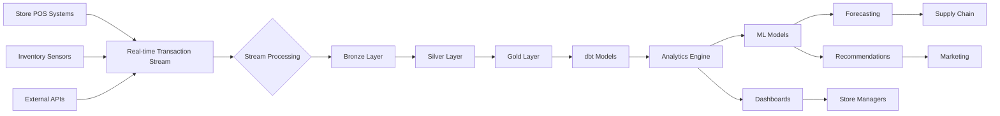

# Retail Analytics Platform

Omnichannel retail operations platform with real-time point-of-sale (POS), inventory management, customer analytics, and supply chain optimization.

## Overview

Enterprise retail analytics system for multi-location retail operations:
- Real-time POS transaction processing and reconciliation
- Inventory management with demand forecasting
- Customer segmentation and personalized offers
- Store performance analytics and benchmarking
- Supply chain optimization and stock level predictions

## Tech Stack

- **Backend**: Python 3.10+ (FastAPI, SQLAlchemy)
- **Database**: PostgreSQL + TimescaleDB
- **Real-time**: Redis (caching), Kafka (event streaming)
- **Analytics**: dbt, Pandas, NumPy
- **ML**: Scikit-learn, LightGBM (forecasting)
- **Dashboard**: Streamlit + Plotly
- **Orchestration**: Airflow
- **Infrastructure**: Docker, Kubernetes, AWS S3
- **CI/CD**: GitHub Actions

## Architecture



## Key Modules

| Module | Description |
|--------|-------------|
| **POS Processing** | Transaction validation, reconciliation, payment processing |
| **Inventory Management** | Stock tracking, SKU management, reorder optimization |
| **Demand Forecasting** | Sales prediction per store/SKU with confidence intervals |
| **Customer Analytics** | Segment analysis, RFM scoring, purchase patterns |
| **Supply Chain** | Replenishment planning, optimal stock levels, warehouse allocation |
| **Store Performance** | KPI tracking, sales analysis, staff productivity metrics |

## Project Structure

```
retail/
├── data/
│   ├── samples/          # Sample transaction data
│   └── schemas/          # Data schema definitions
├── src/
│   ├── pos/
│   │   ├── transaction.py    # Transaction processing
│   │   ├── reconciler.py     # Daily reconciliation
│   │   └── validator.py      # Data validation
│   ├── inventory/
│   │   ├── manager.py        # Inventory operations
│   │   ├── reorder.py        # Reorder optimization
│   │   └── sku.py            # SKU management
│   ├── forecasting/
│   │   ├── demand.py         # Demand forecasting
│   │   ├── models.py         # ML models
│   │   └── evaluator.py      # Model evaluation
│   ├── analytics/
│   │   ├── customer.py       # Customer analytics
│   │   ├── store.py          # Store performance
│   │   └── metrics.py        # KPI calculations
│   ├── api/
│   │   ├── app.py            # FastAPI application
│   │   ├── routes.py         # API endpoints
│   │   └── schemas.py        # Request/response schemas
│   ├── stream/
│   │   ├── consumer.py       # Kafka consumer
│   │   └── processor.py      # Stream processing
│   └── dashboards/
│       ├── app.py            # Streamlit entry
│       └── pages/            # Dashboard pages
├── dbt/
│   ├── models/
│   │   ├── staging/
│   │   ├── intermediate/
│   │   └── marts/
│   └── tests/
├── airflow/
│   └── dags/
├── tests/
├── docker-compose.yml
├── requirements.txt
└── .github/workflows/
```

## Quick Start

### Setup

```bash
git clone https://github.com/willtran112358/retail-analytics-platform.git
cd retail

# Create environment
python -m venv venv
source venv/bin/activate

# Install dependencies
pip install -r requirements.txt

# Configure environment
cp .env.example .env
```

### Run Services

```bash
# Start Docker containers
docker-compose up -d

# Initialize database
python src/pos/setup_db.py

# Run data models
cd dbt && dbt run && cd ..

# Start API server
uvicorn src.api.app:app --reload

# Launch dashboard
streamlit run src/dashboards/app.py
```

### Example Usage

```python
from src.pos.transaction import TransactionProcessor
from src.inventory.manager import InventoryManager

# Process transaction
processor = TransactionProcessor()
result = processor.process_transaction({
    "store_id": "STORE_001",
    "transaction_id": "TXN_12345",
    "items": [{"sku": "SKU_001", "quantity": 2, "price": 29.99}],
    "timestamp": "2024-05-13T10:30:00Z"
})

# Update inventory
inv_manager = InventoryManager()
inv_manager.adjust_stock("STORE_001", "SKU_001", -2)
```

## API Endpoints

```
GET  /stores                      # List all stores
GET  /stores/{store_id}/inventory # Get store inventory
POST /transactions               # Record transaction
GET  /analytics/forecast         # Demand forecast
GET  /customers/{id}/analytics   # Customer analytics
```

## Performance

- POS transaction processing: <100ms
- Dashboard refresh: Real-time
- Demand forecast latency: ~5 minutes (daily retraining)
- API p95 latency: <200ms

## Testing

```bash
pytest tests/ -v
pytest tests/integration/ --markers integration
```

## Contributing

1. Fork repository
2. Create feature branch
3. Implement changes + tests
4. Submit pull request

## License

MIT License

## Author

**WillTran** — [@willtran112358](https://github.com/willtran112358)
